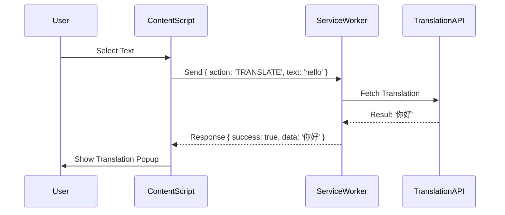
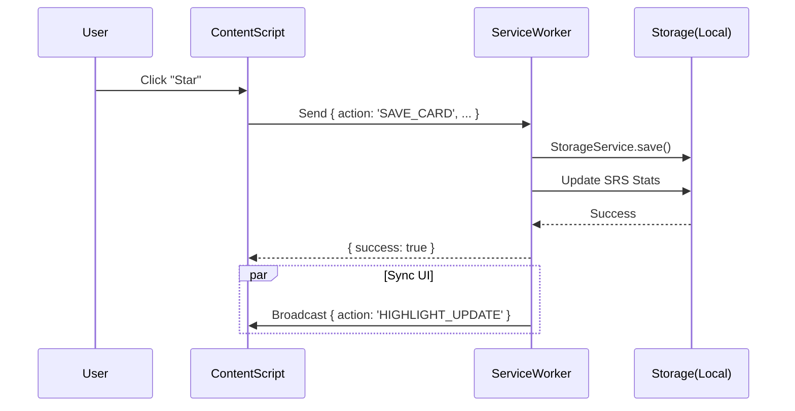
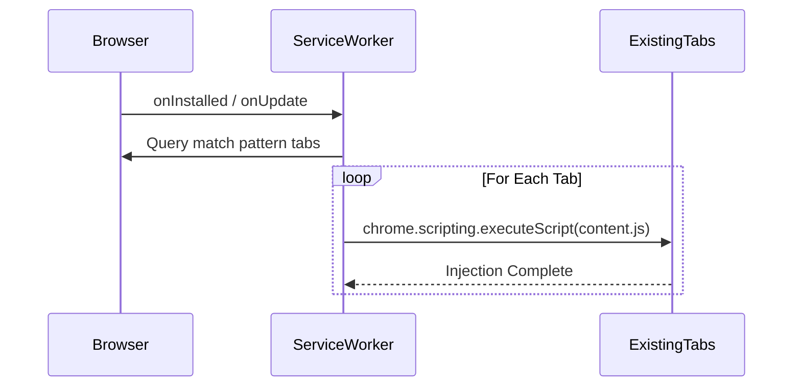

# 05-flow-diagrams.md - Message Flows

## 1. 翻譯請求流程 (Translation Flow)

```mermaid
sequenceDiagram
    participant User
    participant ContentScript
    participant ServiceWorker
    participant TranslationAPI

    User->>ContentScript: Select Text
    ContentScript->>ServiceWorker: Send { action: 'TRANSLATE', text: 'hello' }
    ServiceWorker->>TranslationAPI: Fetch Translation
    TranslationAPI-->>ServiceWorker: Result '你好'
    ServiceWorker-->>ContentScript: Response { success: true, data: '你好' }
    ContentScript->>User: Show Translation Popup
```

## 2. 儲存/收藏單字 (Save Card Flow)

```mermaid
sequenceDiagram
    participant User
    participant ContentScript
    participant ServiceWorker
    participant Storage(Local)

    User->>ContentScript: Click "Star"
    ContentScript->>ServiceWorker: Send { action: 'SAVE_CARD', ... }
    ServiceWorker->>Storage(Local): StorageService.save()
    ServiceWorker->>Storage(Local): Update SRS Stats
    Storage(Local)-->>ServiceWorker: Success
    ServiceWorker-->>ContentScript: { success: true }

    par Sync UI
        ServiceWorker->>ContentScript: Broadcast { action: 'HIGHLIGHT_UPDATE' }
    end
```

## 3. 動態注入 (Dynamic Injection Flow)

```mermaid
sequenceDiagram
    participant Browser
    participant ServiceWorker
    participant ExistingTabs

    Browser->>ServiceWorker: onInstalled / onUpdate
    ServiceWorker->>Browser: Query match pattern tabs
    loop For Each Tab
        ServiceWorker->>ExistingTabs: chrome.scripting.executeScript(content.js)
        ExistingTabs-->>ServiceWorker: Injection Complete
    end
```
