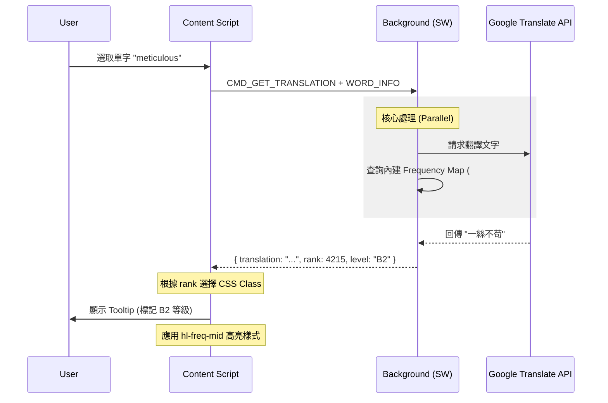
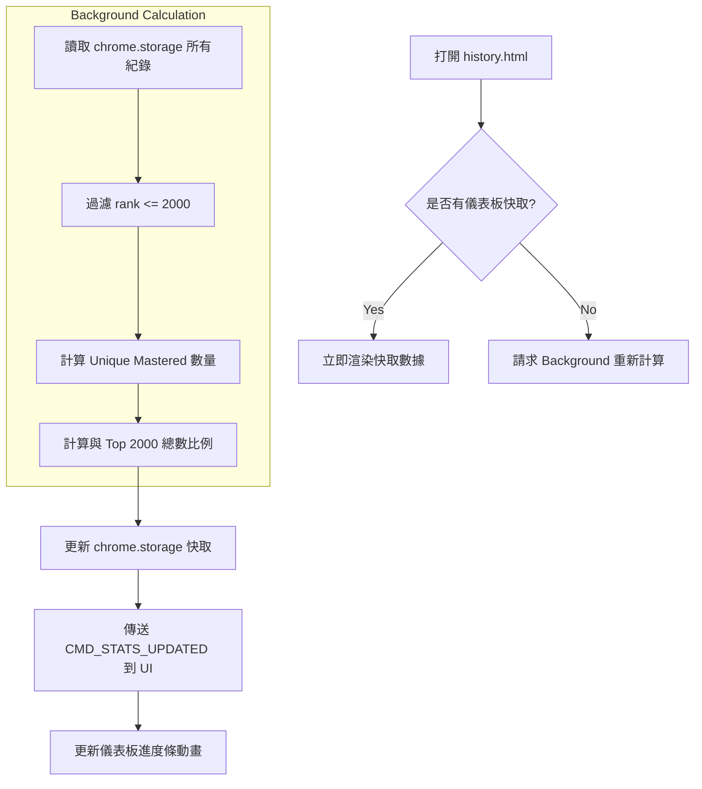
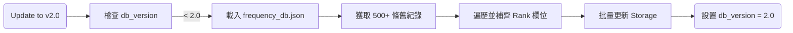

# 05-flow-diagrams.md - Message & Data Flow

## 1. 詞頻查詢與翻譯流程 (Lookup Flow)

當使用者在網頁上選取單字並觸發翻譯時的訊息流：

## 2. 儀表板數據彙整流程 (Dashboard Refresh)

當使用者打開歷史紀錄頁面時，如何計算覆蓋率：

## 3. 數據遷移流程 (Migration Flow)

擴充功能更新後的背景任務：

