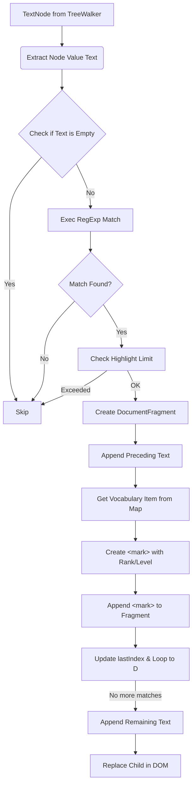

```
TASK: 訊息流圖設計
EXPECTED OUTCOME: .shared/05-flow-diagrams.md
REQUIRED AGENT: Mermaid Designer
CONTEXT: .shared/04-tech-architecture.md
```

# 系統流程圖 (System Flow Diagrams)

## 1. 高亮核心處理流程 (Highlight Processing Flow)


```mermaid
flowchart TD
    A[TextNode from TreeWalker] --> B(Extract Node Value Text)
    B --> C{Check if Text is Empty}
    C -- Yes --> Z[Skip]
    C -- No --> D[Exec RegExp Match]
    D --> E{Match Found?}
    E -- No --> Z
    E -- Yes --> F[Check Highlight Limit]
    F -- Exceeded --> Z
    F -- OK --> G[Create DocumentFragment]
    G --> H[Append Preceding Text]
    H --> I[Get Vocabulary Item from Map]
    I --> J[Create &lt;mark&gt; with Rank/Level]
    J --> K[Append &lt;mark&gt; to Fragment]
    K --> L[Update lastIndex & Loop to D]
    L -- "No more matches" --> M[Append Remaining Text]
    M --> N[Replace Child in DOM]
```

## 2. 正規表達式構建流程 (RegExp Construction Flow)

```mermaid
flowchart LR
    A[Vocabulary Items] --> B[Filter valid & minLength]
    B --> C[Normalize to Lowercase]
    C --> D[Escape Special Chars]
    D --> E["Replace Space with \\s+ (For Phrasal Verbs)"]
    E --> F[Sort by Length Descending - Longest Match First]
    F --> G[Join with '|']
    G --> H["Create RegExp with \\b boundaries"]
```
