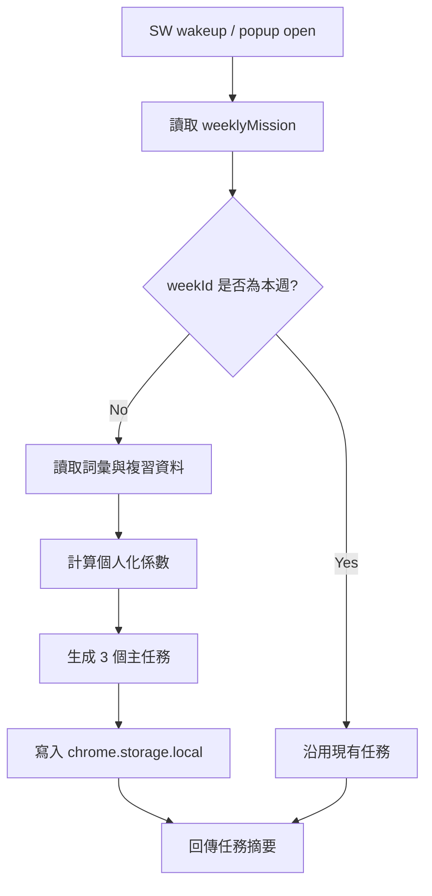
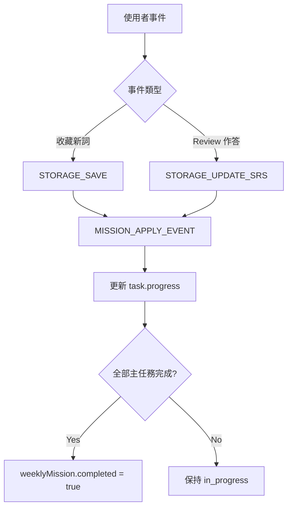
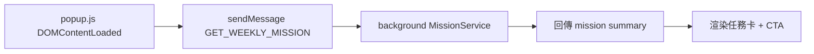
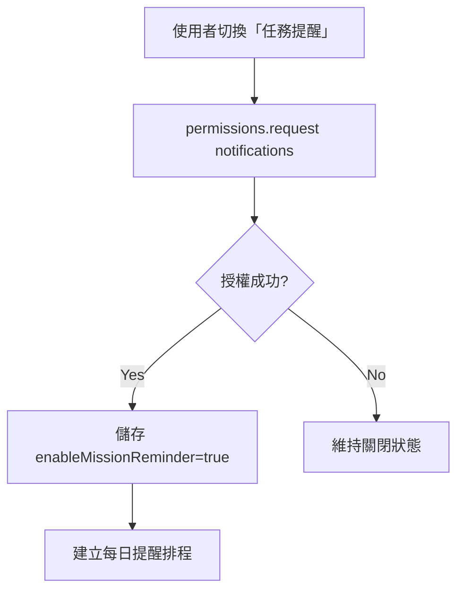
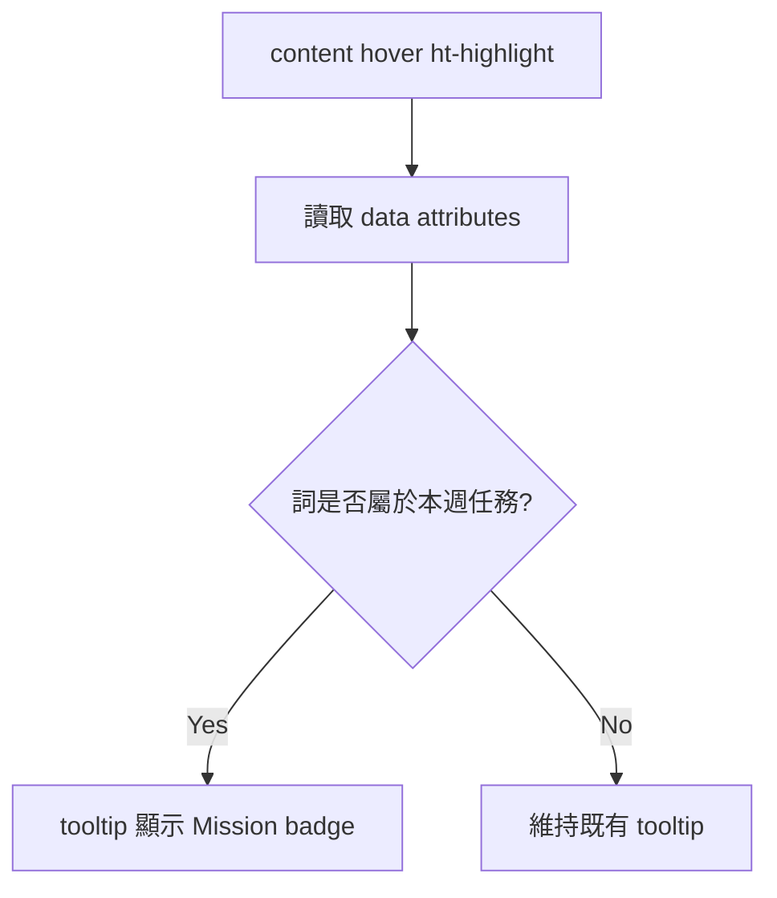

```
TASK: 訊息流與任務流程圖設計
EXPECTED OUTCOME: .shared/05-flow-diagrams.md
REQUIRED AGENT: Mermaid Designer
CONTEXT: .shared/04-tech-architecture.md
```

# 05-flow-diagrams.md

## 1. 週任務生成流程


```mermaid
flowchart TD
    A[SW wakeup / popup open] --> B[讀取 weeklyMission]
    B --> C{weekId 是否為本週?}
    C -- No --> D[讀取詞彙與複習資料]
    D --> E[計算個人化係數]
    E --> F[生成 3 個主任務]
    F --> G[寫入 chrome.storage.local]
    C -- Yes --> H[沿用現有任務]
    G --> I[回傳任務摘要]
    H --> I
```

## 2. 任務進度更新流程


```mermaid
flowchart TD
    A[使用者事件] --> B{事件類型}
    B -- 收藏新詞 --> C[STORAGE_SAVE]
    B -- Review 作答 --> D[STORAGE_UPDATE_SRS]
    C --> E[MISSION_APPLY_EVENT]
    D --> E
    E --> F[更新 task.progress]
    F --> G{全部主任務完成?}
    G -- Yes --> H[weeklyMission.completed = true]
    G -- No --> I[保持 in_progress]
```

## 3. Popup 顯示流程


```mermaid
flowchart LR
    A[popup.js DOMContentLoaded] --> B[sendMessage GET_WEEKLY_MISSION]
    B --> C[background MissionService]
    C --> D[回傳 mission summary]
    D --> E[渲染任務卡 + CTA]
```

## 4. 可選通知權限流程


```mermaid
flowchart TD
    A[使用者切換「任務提醒」] --> B[permissions.request notifications]
    B --> C{授權成功?}
    C -- Yes --> D[儲存 enableMissionReminder=true]
    D --> E[建立每日提醒排程]
    C -- No --> F[維持關閉狀態]
```

## 5. 閱讀提示流程


```mermaid
flowchart TD
    A[content hover ht-highlight] --> B[讀取 data attributes]
    B --> C{詞是否屬於本週任務?}
    C -- Yes --> D[tooltip 顯示 Mission badge]
    C -- No --> E[維持既有 tooltip]
```
