```
TASK: 訊息流圖繪製
EXPECTED OUTCOME: .shared/05-flow-diagrams.md
REQUIRED AGENT: Mermaid Designer
CONTEXT: .shared/04-tech-architecture.md
```

# 05-flow-diagrams.md — Reading Progress Dashboard 訊息流圖

## 1. 翻譯行為記錄流程

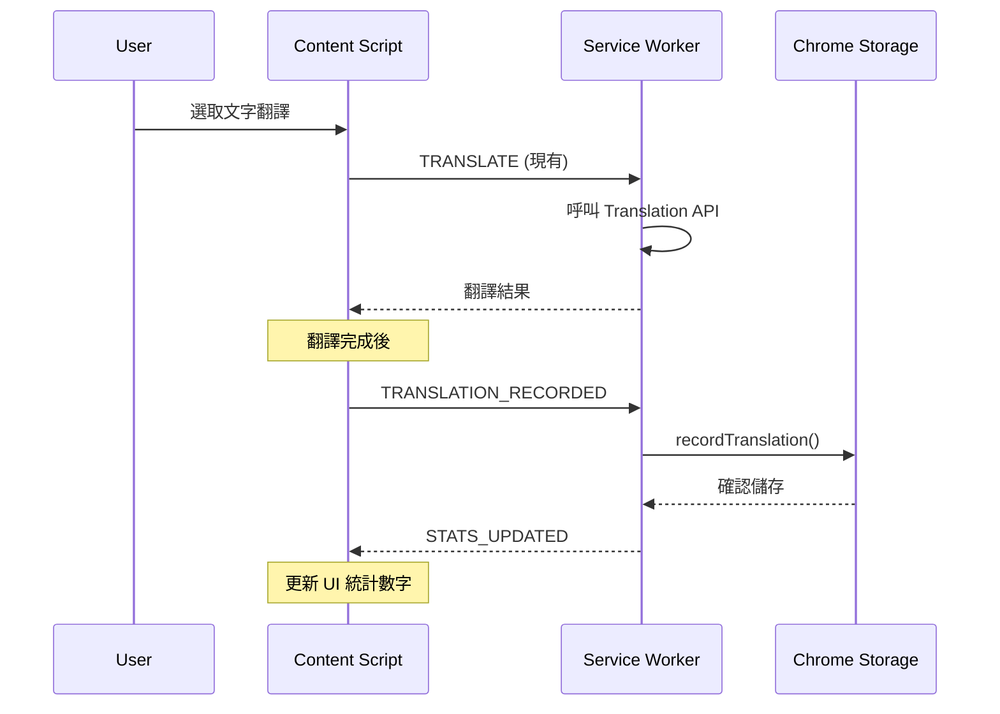
```mermaid
sequenceDiagram
    participant User
    participant Content as Content Script
    participant BG as Service Worker
    participant Storage as Chrome Storage

    User->>Content: 選取文字翻譯
    Content->>BG: TRANSLATE (現有)
    BG->>BG: 呼叫 Translation API
    BG-->>Content: 翻譯結果

    Note over Content: 翻譯完成後

    Content->>BG: TRANSLATION_RECORDED
    BG->>Storage: recordTranslation()
    Storage-->>BG: 確認儲存
    BG-->>Content: STATS_UPDATED

    Note over Content: 更新 UI 統計數字
```

---

## 2. Popup 載入統計流程

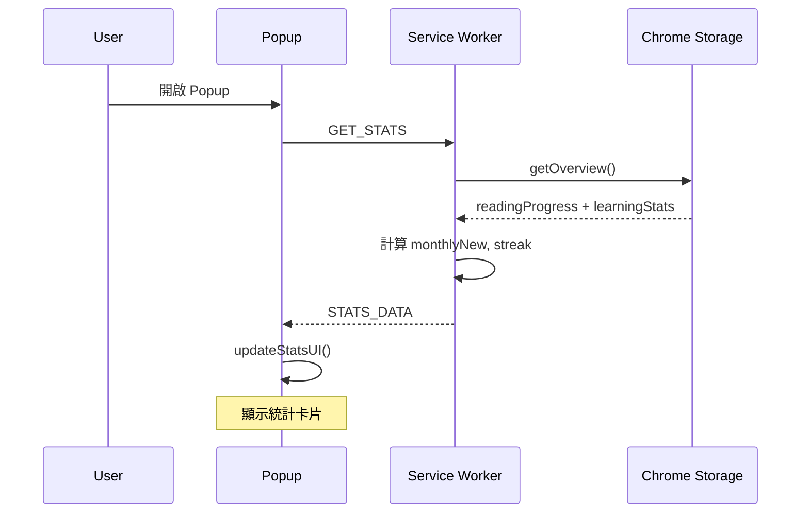
```mermaid
sequenceDiagram
    participant User
    participant Popup
    participant BG as Service Worker
    participant Storage as Chrome Storage

    User->>Popup: 開啟 Popup
    Popup->>BG: GET_STATS
    BG->>Storage: getOverview()
    Storage-->>BG: readingProgress + learningStats
    BG->>BG: 計算 monthlyNew, streak
    BG-->>Popup: STATS_DATA
    Popup->>Popup: updateStatsUI()

    Note over Popup: 顯示統計卡片
```

---

## 3. Dashboard 載入完整統計流程

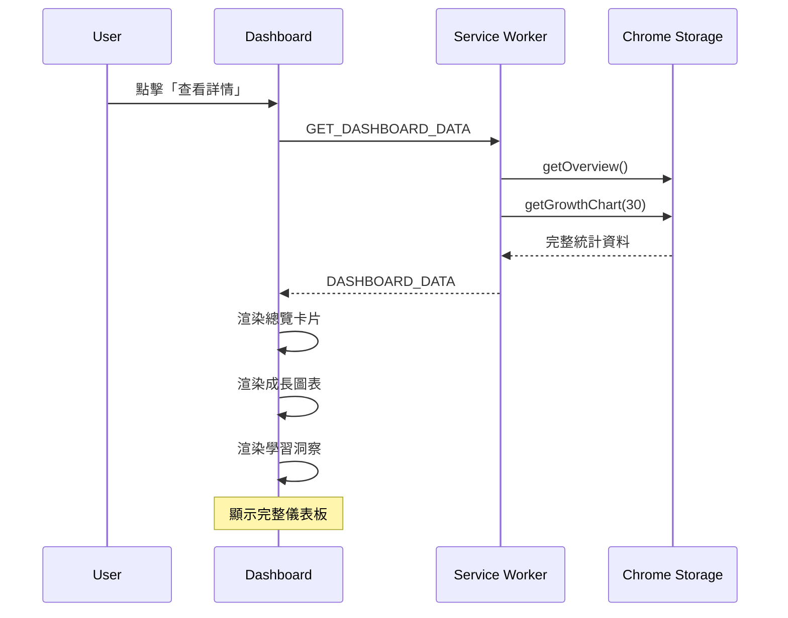
```mermaid
sequenceDiagram
    participant User
    participant Dashboard
    participant BG as Service Worker
    participant Storage as Chrome Storage

    User->>Dashboard: 點擊「查看詳情」
    Dashboard->>BG: GET_DASHBOARD_DATA
    BG->>Storage: getOverview()
    BG->>Storage: getGrowthChart(30)
    Storage-->>BG: 完整統計資料
    BG-->>Dashboard: DASHBOARD_DATA

    Dashboard->>Dashboard: 渲染總覽卡片
    Dashboard->>Dashboard: 渲染成長圖表
    Dashboard->>Dashboard: 渲染學習洞察

    Note over Dashboard: 顯示完整儀表板
```

---

## 4. Streak 計算流程

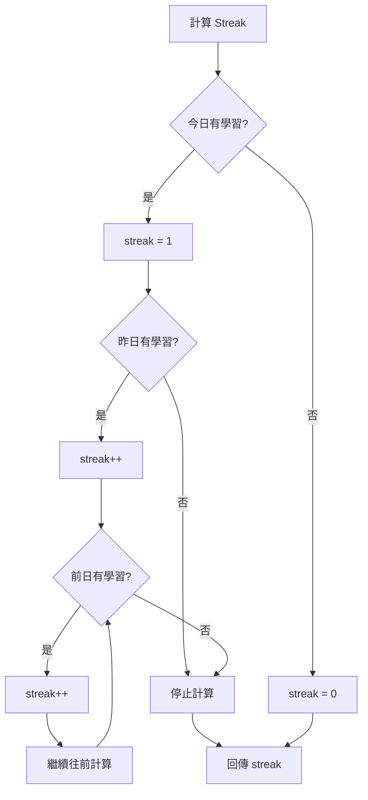
```mermaid
flowchart TD
    A[計算 Streak] --> B{今日有學習?}
    B -->|是| C[streak = 1]
    B -->|否| D[streak = 0]
    
    C --> E{昨日有學習?}
    E -->|是| F[streak++]
    E -->|否| G[停止計算]
    
    F --> H{前日有學習?}
    H -->|是| I[streak++]
    H -->|否| G
    
    I --> J[繼續往前計算]
    J --> H
    
    G --> K[回傳 streak]
    
    D --> K
```

---

## 5. 里程碑判定流程

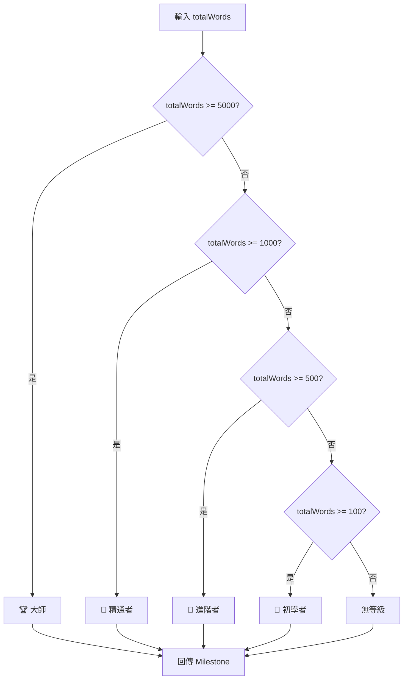
```mermaid
flowchart TD
    A[輸入 totalWords] --> B{totalWords >= 5000?}
    B -->|是| C[🏆 大師]
    B -->|否| D{totalWords >= 1000?}
    D -->|是| E[🌳 精通者]
    D -->|否| F{totalWords >= 500?}
    F -->|是| G[🌿 進階者]
    F -->|否| H{totalWords >= 100?}
    H -->|是| I[🌱 初學者]
    H -->|否| J[無等級]
    
    C --> K[回傳 Milestone]
    E --> K
    G --> K
    I --> K
    J --> K
```

---

## 6. 分享卡片生成流程

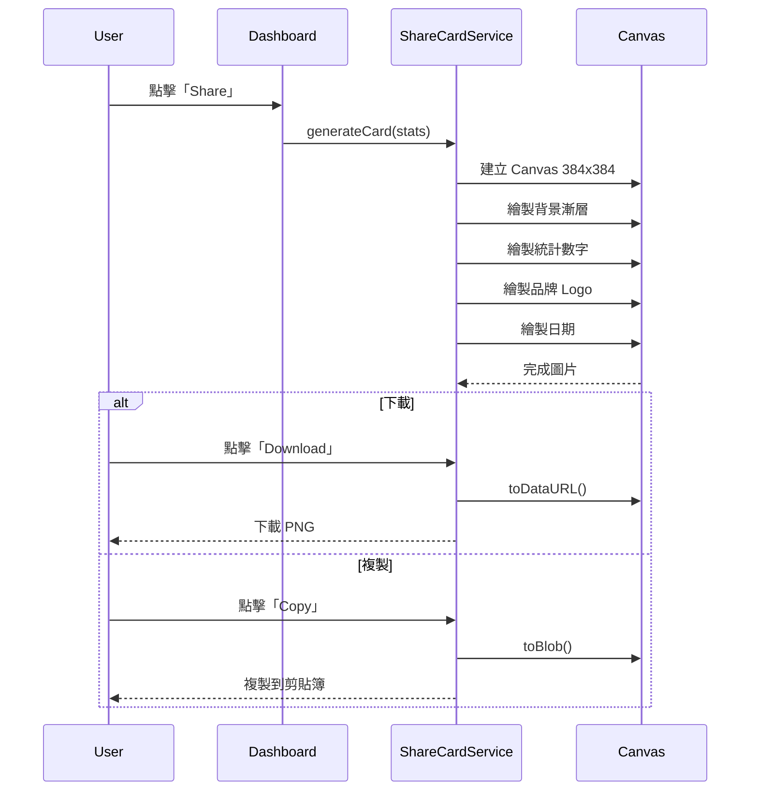
```mermaid
sequenceDiagram
    participant User
    participant Dashboard
    participant ShareCard as ShareCardService
    participant Canvas

    User->>Dashboard: 點擊「Share」
    Dashboard->>ShareCard: generateCard(stats)
    ShareCard->>Canvas: 建立 Canvas 384x384
    ShareCard->>Canvas: 繪製背景漸層
    ShareCard->>Canvas: 繪製統計數字
    ShareCard->>Canvas: 繪製品牌 Logo
    ShareCard->>Canvas: 繪製日期
    Canvas-->>ShareCard: 完成圖片
    
    alt 下載
        User->>ShareCard: 點擊「Download」
        ShareCard->>Canvas: toDataURL()
        ShareCard-->>User: 下載 PNG
    else 複製
        User->>ShareCard: 點擊「Copy」
        ShareCard->>Canvas: toBlob()
        ShareCard-->>User: 複製到剪貼簿
    end
```

---

## 7. 資料聚合流程

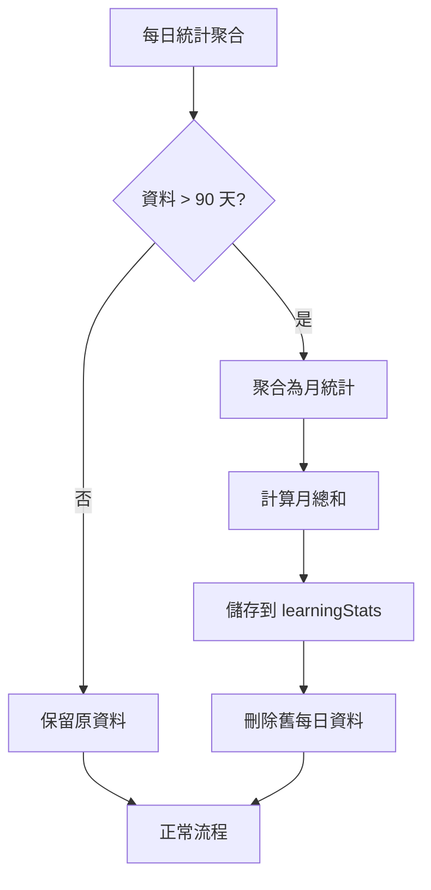
```mermaid
flowchart TD
    A[每日統計聚合] --> B{資料 > 90 天?}
    B -->|是| C[聚合為月統計]
    B -->|否| D[保留原資料]
    
    C --> E[計算月總和]
    E --> F[儲存到 learningStats]
    F --> G[刪除舊每日資料]
    
    D --> H[正常流程]
    
    G --> H
```

---

## 8. 與現有功能整合流程

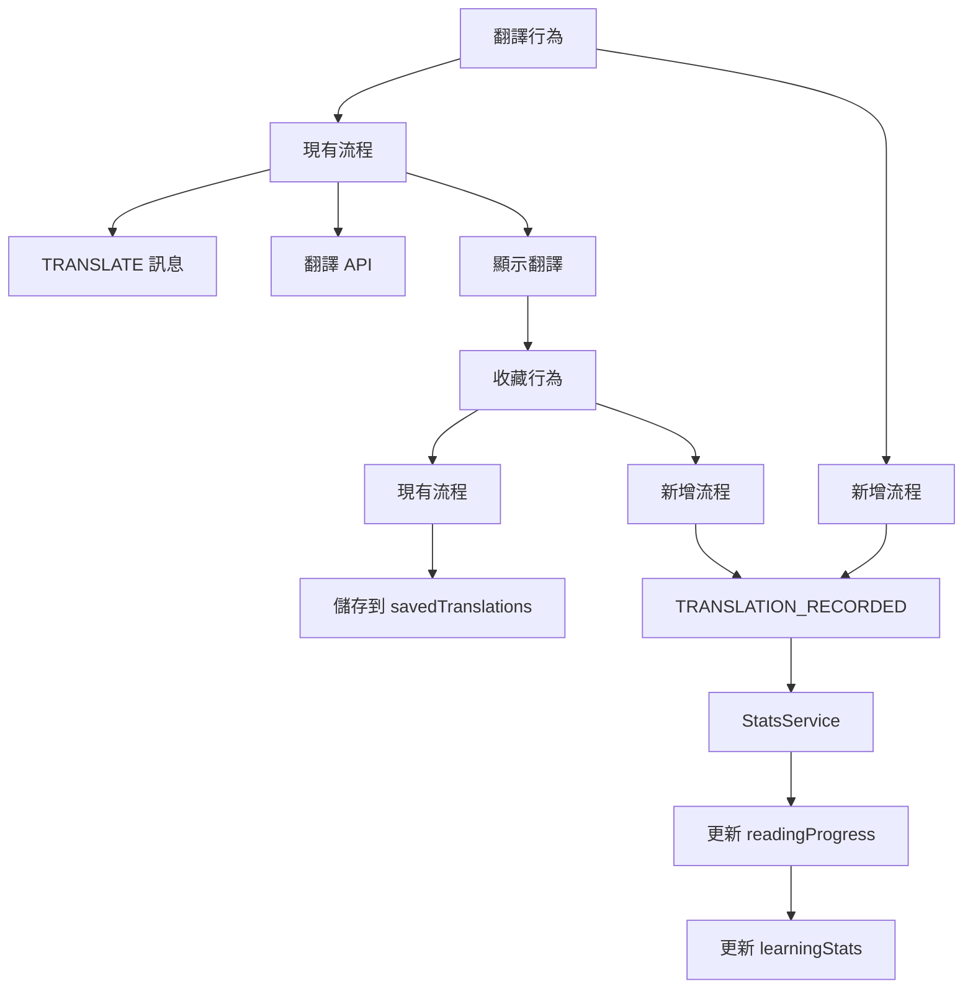
```mermaid
flowchart TD
    A[翻譯行為] --> B[現有流程]
    B --> C[TRANSLATE 訊息]
    B --> D[翻譯 API]
    B --> E[顯示翻譯]
    
    A --> F[新增流程]
    F --> G[TRANSLATION_RECORDED]
    G --> H[StatsService]
    H --> I[更新 readingProgress]
    I --> J[更新 learningStats]
    
    E --> K[收藏行為]
    K --> L[現有流程]
    L --> M[儲存到 savedTranslations]
    
    K --> N[新增流程]
    N --> G
```

---

## 9. 錯誤處理流程

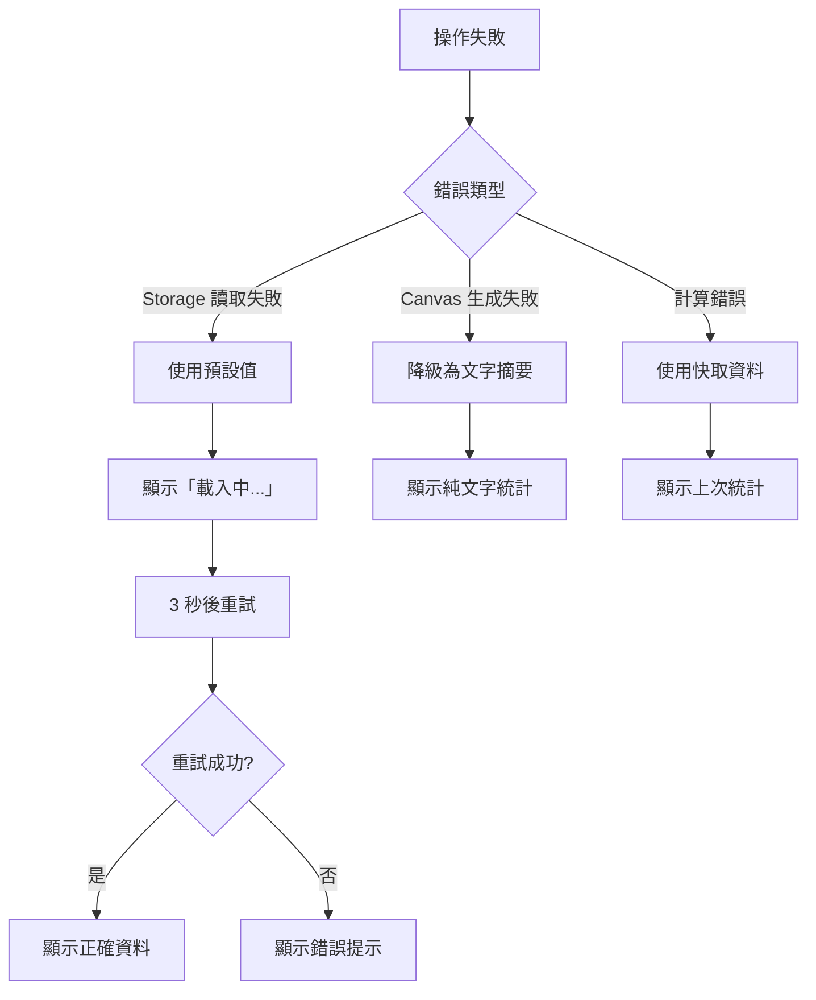
```mermaid
flowchart TD
    A[操作失敗] --> B{錯誤類型}
    
    B -->|Storage 讀取失敗| C[使用預設值]
    C --> D[顯示「載入中...」]
    D --> E[3 秒後重試]
    
    B -->|Canvas 生成失敗| F[降級為文字摘要]
    F --> G[顯示純文字統計]
    
    B -->|計算錯誤| H[使用快取資料]
    H --> I[顯示上次統計]
    
    E --> J{重試成功?}
    J -->|是| K[顯示正確資料]
    J -->|否| L[顯示錯誤提示]
```

---

# 流程增補：Cloud Backup & Cross-Device Sync

## 10. 啟用同步與初始化

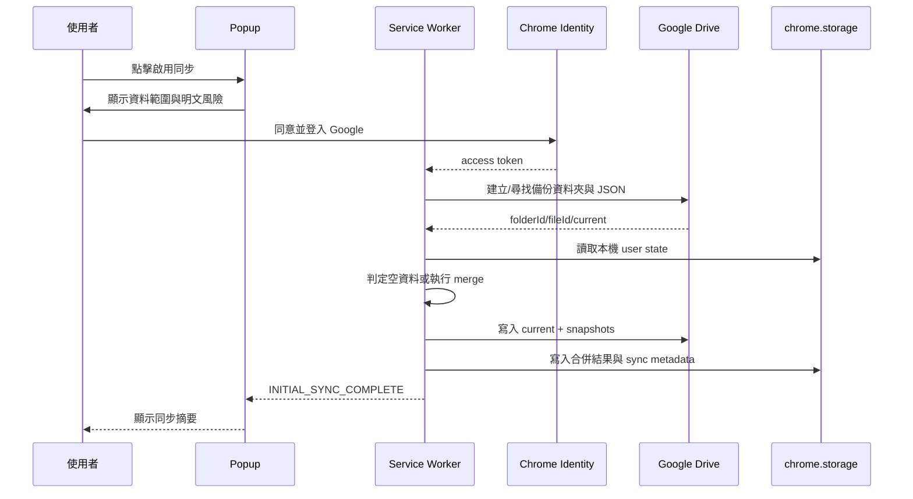
```mermaid
sequenceDiagram
    participant User as 使用者
    participant Popup
    participant BG as Service Worker
    participant Identity as Chrome Identity
    participant Drive as Google Drive
    participant Local as chrome.storage

    User->>Popup: 點擊啟用同步
    Popup->>User: 顯示資料範圍與明文風險
    User->>Identity: 同意並登入 Google
    Identity-->>BG: access token
    BG->>Drive: 建立/尋找備份資料夾與 JSON
    Drive-->>BG: folderId/fileId/current
    BG->>Local: 讀取本機 user state
    BG->>BG: 判定空資料或執行 merge
    BG->>Drive: 寫入 current + snapshots
    BG->>Local: 寫入合併結果與 sync metadata
    BG-->>Popup: INITIAL_SYNC_COMPLETE
    Popup-->>User: 顯示同步摘要
```

## 11. 本機變更與 debounce 上傳

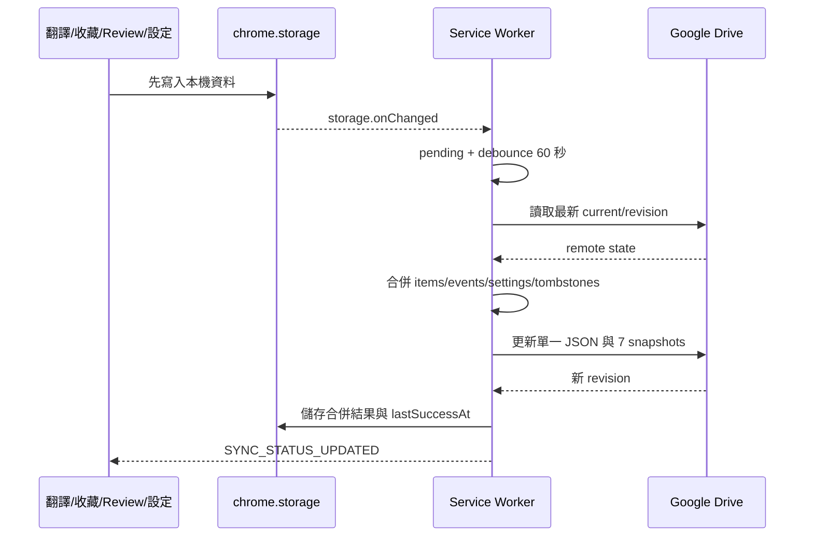
```mermaid
sequenceDiagram
    participant Feature as 翻譯/收藏/Review/設定
    participant Storage as chrome.storage
    participant BG as Service Worker
    participant Drive as Google Drive

    Feature->>Storage: 先寫入本機資料
    Storage-->>BG: storage.onChanged
    BG->>BG: pending + debounce 60 秒
    BG->>Drive: 讀取最新 current/revision
    Drive-->>BG: remote state
    BG->>BG: 合併 items/events/settings/tombstones
    BG->>Drive: 更新單一 JSON 與 7 snapshots
    Drive-->>BG: 新 revision
    BG->>Storage: 儲存合併結果與 lastSuccessAt
    BG-->>Feature: SYNC_STATUS_UPDATED
```

## 12. 遠端輪詢與跨裝置合併

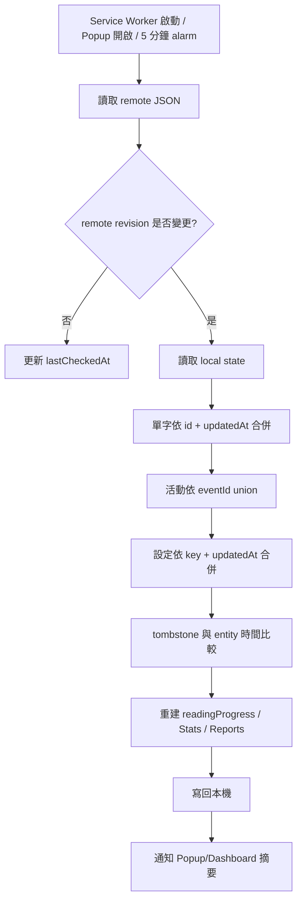
```mermaid
flowchart TD
    A[Service Worker 啟動 / Popup 開啟 / 5 分鐘 alarm] --> B[讀取 remote JSON]
    B --> C{remote revision 是否變更?}
    C -->|否| D[更新 lastCheckedAt]
    C -->|是| E[讀取 local state]
    E --> F[單字依 id + updatedAt 合併]
    F --> G[活動依 eventId union]
    G --> H[設定依 key + updatedAt 合併]
    H --> I[tombstone 與 entity 時間比較]
    I --> J[重建 readingProgress / Stats / Reports]
    J --> K[寫回本機]
    K --> L[通知 Popup/Dashboard 摘要]
```

## 13. 還原歷史版本

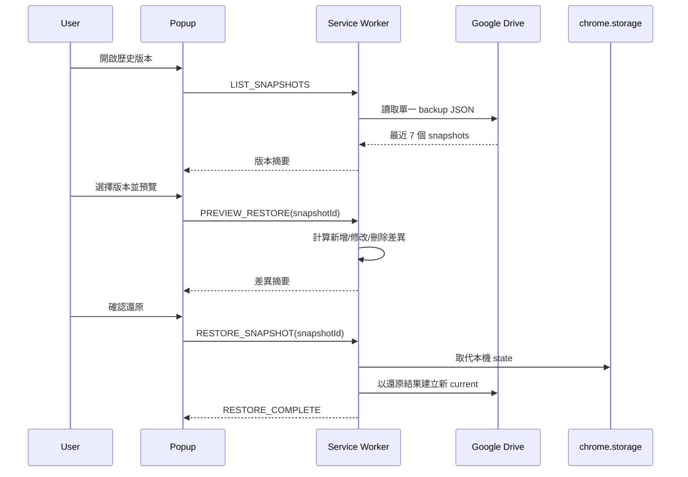
```mermaid
sequenceDiagram
    participant User
    participant Popup
    participant BG as Service Worker
    participant Drive as Google Drive
    participant Local as chrome.storage

    User->>Popup: 開啟歷史版本
    Popup->>BG: LIST_SNAPSHOTS
    BG->>Drive: 讀取單一 backup JSON
    Drive-->>BG: 最近 7 個 snapshots
    BG-->>Popup: 版本摘要
    User->>Popup: 選擇版本並預覽
    Popup->>BG: PREVIEW_RESTORE(snapshotId)
    BG->>BG: 計算新增/修改/刪除差異
    BG-->>Popup: 差異摘要
    User->>Popup: 確認還原
    Popup->>BG: RESTORE_SNAPSHOT(snapshotId)
    BG->>Local: 取代本機 state
    BG->>Drive: 以還原結果建立新 current
    BG-->>Popup: RESTORE_COMPLETE
```

## 14. CLEAR 與刪除同步

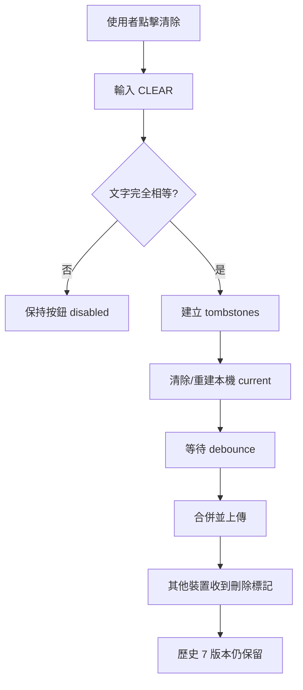
```mermaid
flowchart TD
    A[使用者點擊清除] --> B[輸入 CLEAR]
    B --> C{文字完全相等?}
    C -->|否| D[保持按鈕 disabled]
    C -->|是| E[建立 tombstones]
    E --> F[清除/重建本機 current]
    F --> G[等待 debounce]
    G --> H[合併並上傳]
    H --> I[其他裝置收到刪除標記]
    I --> J[歷史 7 版本仍保留]
```

## 15. 失敗重試

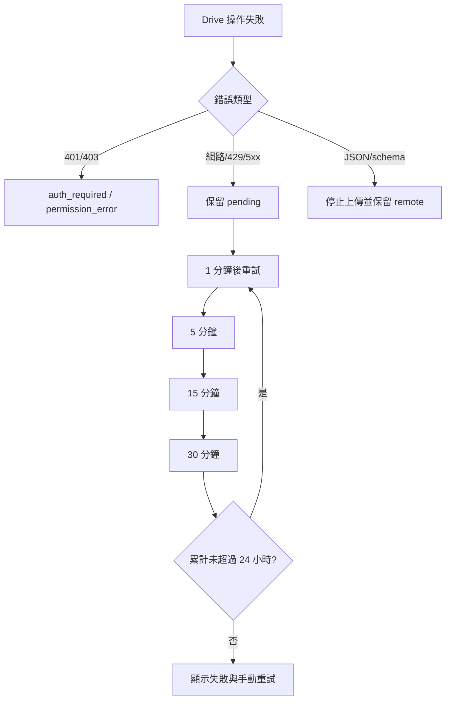
```mermaid
flowchart TD
    A[Drive 操作失敗] --> B{錯誤類型}
    B -->|401/403| C[auth_required / permission_error]
    B -->|網路/429/5xx| D[保留 pending]
    B -->|JSON/schema| E[停止上傳並保留 remote]
    D --> F[1 分鐘後重試]
    F --> G[5 分鐘]
    G --> H[15 分鐘]
    H --> I[30 分鐘]
    I --> J{累計未超過 24 小時?}
    J -->|是| F
    J -->|否| K[顯示失敗與手動重試]
```
