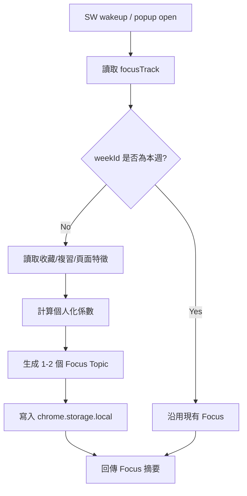
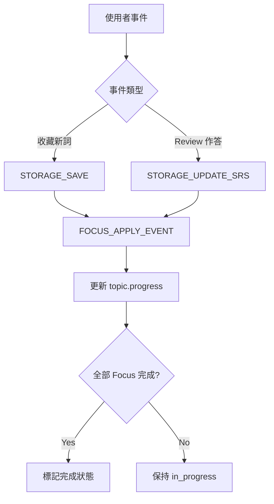
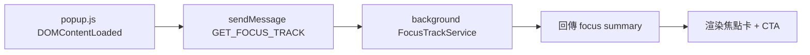
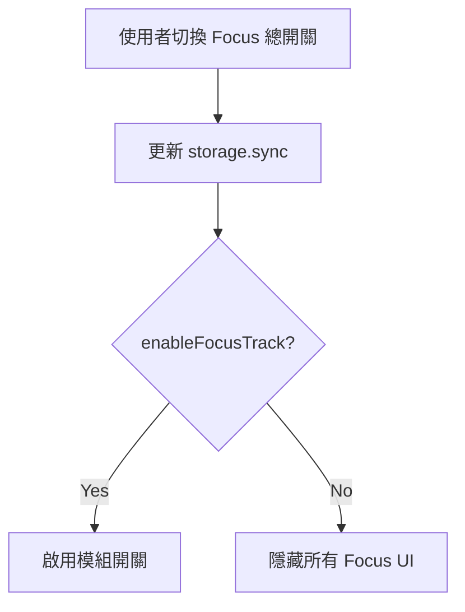
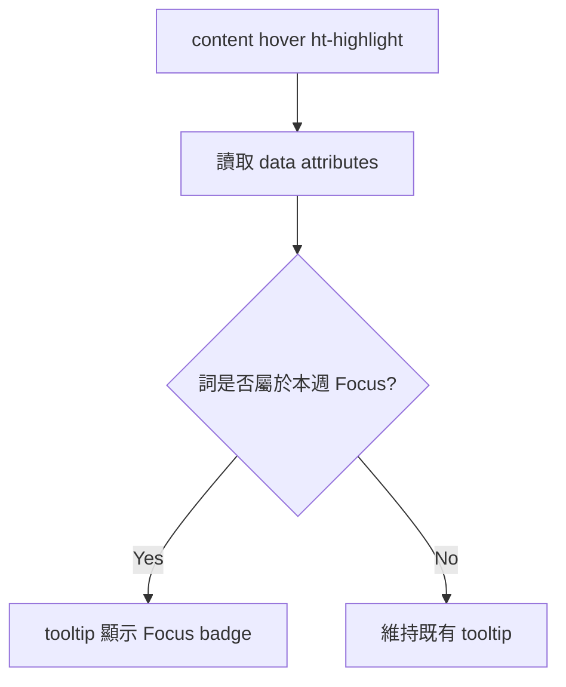

```
TASK: 訊息流與焦點流程圖設計
EXPECTED OUTCOME: .shared/05-flow-diagrams.md
REQUIRED AGENT: Mermaid Designer
CONTEXT: .shared/04-tech-architecture.md
```

# 05-flow-diagrams.md

## 1. 週 Focus 生成流程


```mermaid
flowchart TD
    A[SW wakeup / popup open] --> B[讀取 focusTrack]
    B --> C{weekId 是否為本週?}
    C -- No --> D[讀取收藏/複習/頁面特徵]
    D --> E[計算個人化係數]
    E --> F[生成 1-2 個 Focus Topic]
    F --> G[寫入 chrome.storage.local]
    C -- Yes --> H[沿用現有 Focus]
    G --> I[回傳 Focus 摘要]
    H --> I
```

## 2. Focus 進度更新流程


```mermaid
flowchart TD
    A[使用者事件] --> B{事件類型}
    B -- 收藏新詞 --> C[STORAGE_SAVE]
    B -- Review 作答 --> D[STORAGE_UPDATE_SRS]
    C --> E[FOCUS_APPLY_EVENT]
    D --> E
    E --> F[更新 topic.progress]
    F --> G{全部 Focus 完成?}
    G -- Yes --> H[標記完成狀態]
    G -- No --> I[保持 in_progress]
```

## 3. Popup 顯示流程


```mermaid
flowchart LR
    A[popup.js DOMContentLoaded] --> B[sendMessage GET_FOCUS_TRACK]
    B --> C[background FocusTrackService]
    C --> D[回傳 focus summary]
    D --> E[渲染焦點卡 + CTA]
```

## 4. Options 開關流程


```mermaid
flowchart TD
    A[使用者切換 Focus 總開關] --> B[更新 storage.sync]
    B --> C{enableFocusTrack?}
    C -- Yes --> D[啟用模組開關]
    C -- No --> E[隱藏所有 Focus UI]
```

## 5. 閱讀提示流程


```mermaid
flowchart TD
    A[content hover ht-highlight] --> B[讀取 data attributes]
    B --> C{詞是否屬於本週 Focus?}
    C -- Yes --> D[tooltip 顯示 Focus badge]
    C -- No --> E[維持既有 tooltip]
```
