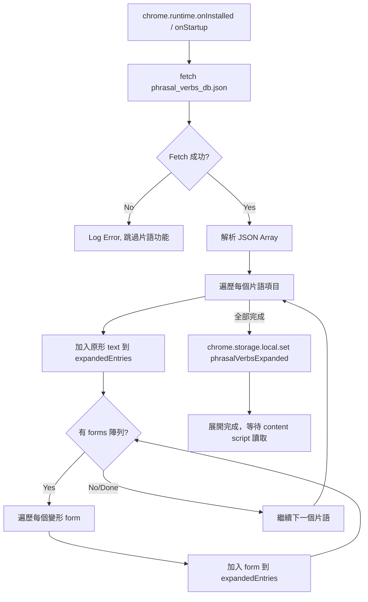
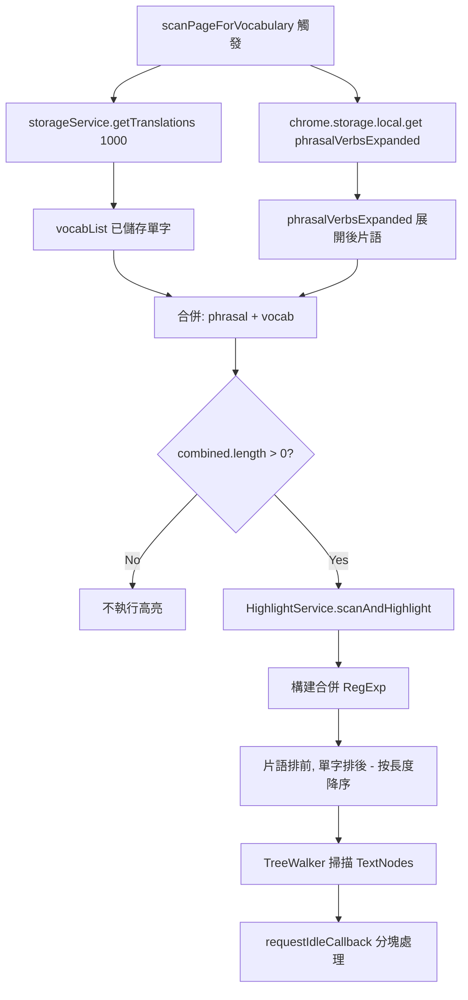
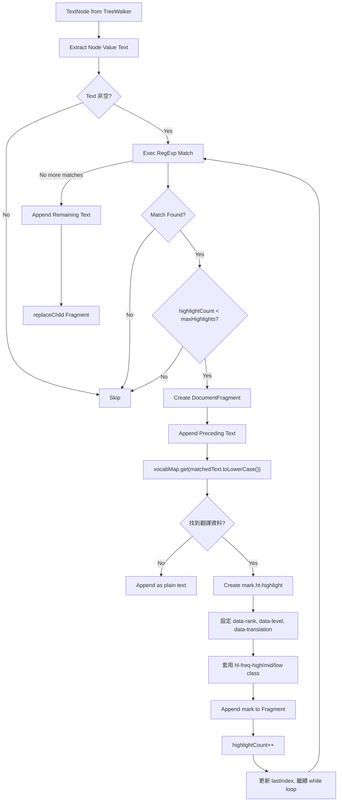
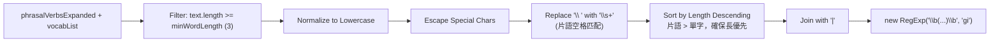

```
TASK: 訊息流圖設計
EXPECTED OUTCOME: .shared/05-flow-diagrams.md
REQUIRED AGENT: Mermaid Designer
CONTEXT: .shared/04-tech-architecture.md
```

# 系統流程圖 (System Flow Diagrams)

> **版本**: v2 — 片語資料庫 Level 1 整合 (2026-03-07)

---

## 1. 片語 DB 載入與展開流程 (Phrasal Verbs Load & Expand)


```mermaid
flowchart TD
    A[chrome.runtime.onInstalled / onStartup] --> B[fetch phrasal_verbs_db.json]
    B --> C{Fetch 成功?}
    C -- No --> Z[Log Error, 跳過片語功能]
    C -- Yes --> D[解析 JSON Array]
    D --> E[遍歷每個片語項目]
    E --> F[加入原形 text 到 expandedEntries]
    F --> G{有 forms 陣列?}
    G -- Yes --> H[遍歷每個變形 form]
    H --> I[加入 form 到 expandedEntries]
    I --> G
    G -- No/Done --> J[繼續下一個片語]
    J --> E
    E -- 全部完成 --> K[chrome.storage.local.set phrasalVerbsExpanded]
    K --> L[展開完成，等待 content script 讀取]
```

---

## 2. Content Script 詞彙合併流程 (Vocabulary Merge Flow)


```mermaid
flowchart TD
    A[scanPageForVocabulary 觸發] --> B[storageService.getTranslations 1000]
    A --> C[chrome.storage.local.get phrasalVerbsExpanded]
    B --> D[vocabList 已儲存單字]
    C --> E[phrasalVerbsExpanded 展開後片語]
    D --> F[合併: phrasal + vocab]
    E --> F
    F --> G{combined.length > 0?}
    G -- No --> Z[不執行高亮]
    G -- Yes --> H[HighlightService.scanAndHighlight]
    H --> I[構建合併 RegExp]
    I --> J[片語排前, 單字排後 - 按長度降序]
    J --> K[TreeWalker 掃描 TextNodes]
    K --> L[requestIdleCallback 分塊處理]
```

---

## 3. 高亮核心處理流程 (Highlight Processing Flow — 更新版)


```mermaid
flowchart TD
    A[TextNode from TreeWalker] --> B[Extract Node Value Text]
    B --> C{Text 非空?}
    C -- No --> Z[Skip]
    C -- Yes --> D[Exec RegExp Match]
    D --> E{Match Found?}
    E -- No --> Z
    E -- Yes --> F{highlightCount < maxHighlights?}
    F -- No --> Z
    F -- Yes --> G[Create DocumentFragment]
    G --> H[Append Preceding Text]
    H --> I["vocabMap.get(matchedText.toLowerCase())"]
    I --> J{找到翻譯資料?}
    J -- No --> K[Append as plain text]
    J -- Yes --> L[Create mark.ht-highlight]
    L --> M[設定 data-rank, data-level, data-translation]
    M --> N[套用 hl-freq-high/mid/low class]
    N --> O[Append mark to Fragment]
    O --> P[highlightCount++]
    P --> Q[更新 lastIndex, 繼續 while loop]
    Q --> D
    D -- "No more matches" --> R[Append Remaining Text]
    R --> S[replaceChild Fragment]
```

---

## 4. 正規表達式構建流程 (RegExp Construction Flow — 含片語)


```mermaid
flowchart LR
    A["phrasalVerbsExpanded + vocabList"] --> B["Filter: text.length >= minWordLength (3)"]
    B --> C[Normalize to Lowercase]
    C --> D[Escape Special Chars]
    D --> E["Replace '\\ ' with '\\s+'\n(片語空格匹配)"]
    E --> F["Sort by Length Descending\n片語 > 單字，確保長優先"]
    F --> G["Join with '|'"]
    G --> H["new RegExp('\\b(...)\\b', 'gi')"]
```

---

## 5. Tooltip 顯示流程 (Tooltip Display — 片語版)

```mermaid
flowchart TD
    A["mouseover: e.target.classList.has('ht-highlight')"] --> B[讀取 e.target.dataset]
    B --> C["translation = data-translation (DB 內建，無 API)"]
    B --> D[rank = data-rank]
    B --> E[level = data-level]
    C --> F[tooltipService.show]
    D --> F
    E --> F
    F --> G["顯示 .ht-tooltip 含 rank badge + 翻譯"]
